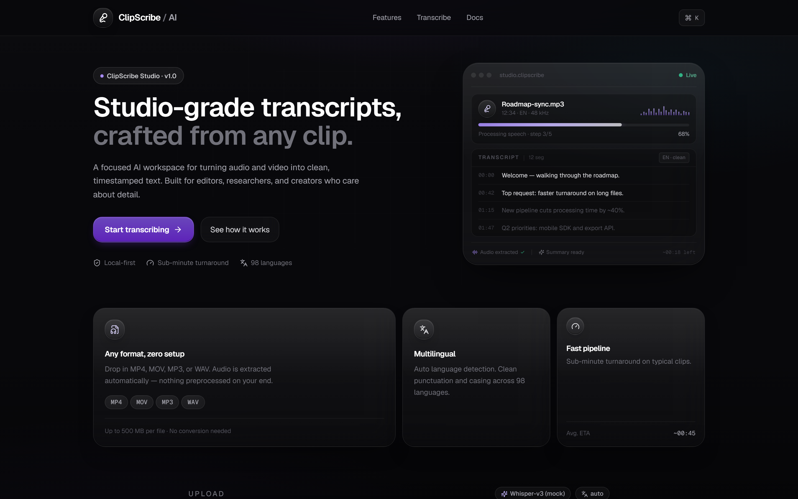
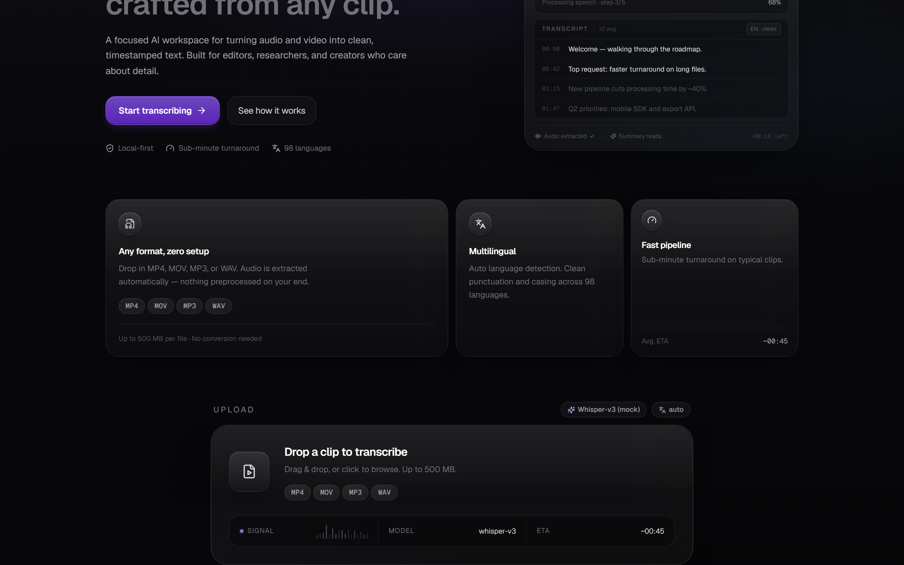
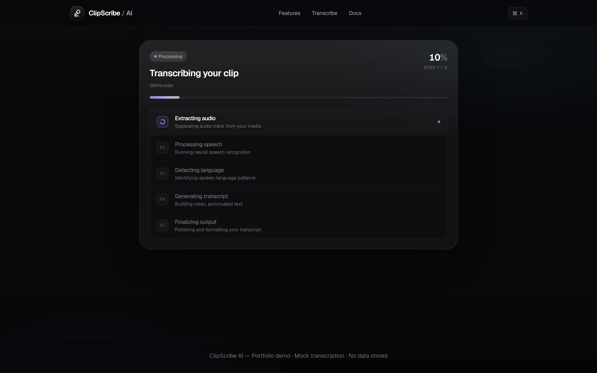
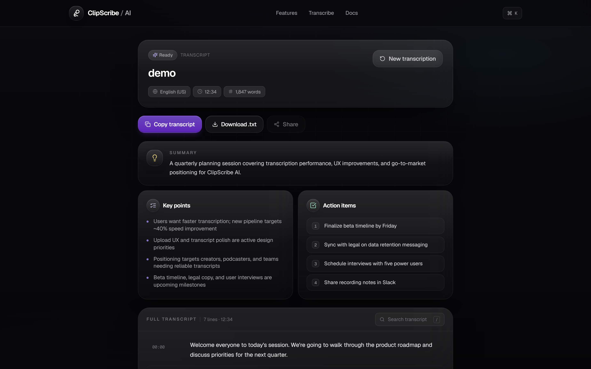
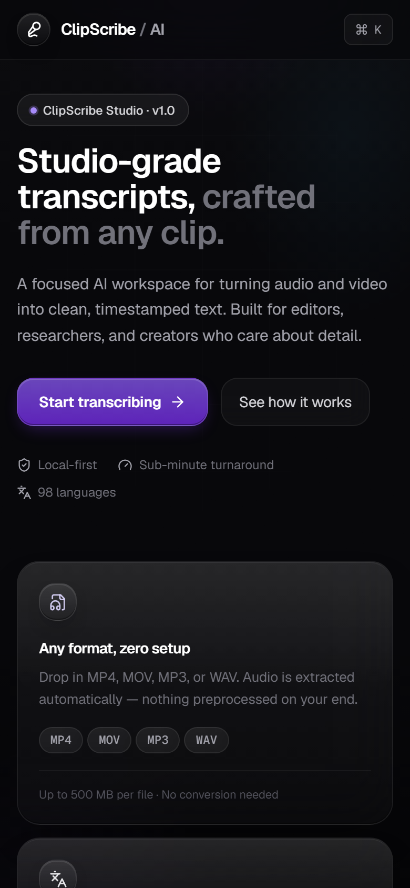

# ClipScribe AI
## Live Demo

https://clipscribeai-ruby.vercel.app/

### Studio-grade transcripts from any clip.


---

## About

**ClipScribe AI** is a premium AI transcription studio with a **Base44 / iOS-inspired** glass interface. Upload audio or video, track processing in real time, and review clean timestamped transcripts with export tools — designed for portfolio, recruiters, and client demos.

Live transcription uses the **OpenAI Whisper API** (`whisper-1`). Without `OPENAI_API_KEY`, the app falls back to mock data. **OpenAI Whisper supports files up to 25 MB** in this MVP — uploads are validated client- and server-side to match that limit.

---

## Features

- AI transcription workflow (upload → progress → processing → result)
- Drag & drop upload — MP4, MOV, MP3, WAV, **25 MB max**, **30 sec minimum**
- Glassmorphism UI with layered panels and calm dark theme
- Animated AI processing steps and progress indicators
- Transcript viewer with timestamp lane, copy, and `.txt` download
- Mock summary — key points and action items
- Fully responsive — desktop dashboard and mobile polish

---

## Screenshots

**Homepage**



**Upload**



**Processing**



**Transcript result**



**Mobile**



---

## Tech Stack

- **Next.js 15** — App Router, React 19
- **TypeScript**
- **Tailwind CSS**
- **Framer Motion**
- **Lucide React**
- **Playwright** — portfolio screenshot automation

---

## Local Setup

```bash
git clone https://github.com/mamunzaman/ClipScribe-AI.git
cd ClipScribe-AI
npm install
npm run dev
```

Visit **http://localhost:3000**

### Environment variables

Copy `.env.local.example` to `.env.local`:

| Variable | Purpose |
|----------|---------|
| `OPENAI_API_KEY` | Live Whisper transcription (optional — mock fallback without it) |
| `DEMO_PASSWORD` | Protects the demo (server-only) |
| `NEXT_PUBLIC_TURNSTILE_SITE_KEY` | Cloudflare Turnstile site key (public) |
| `TURNSTILE_SECRET_KEY` | Turnstile secret for server verification |

**DEMO_PASSWORD** protects the demo UI. **Turnstile** reduces bot/spam abuse on unlock and blocks unauthenticated calls to `/api/transcribe`.

Without `DEMO_PASSWORD` in **development**, the gate is skipped. In **production**, set all env vars on your host (e.g. Vercel).

Demo password is required on **each page reload** (React state only, not `localStorage`). After unlock, a signed **HttpOnly cookie** (`clipscribe_demo_access`, 1 hour) authorizes transcription API calls. **Lock demo** clears the cookie and returns to the gate.

```bash
npm run build
npm run start
```

### Screenshot regeneration

Uses existing Playwright script and files in `docs/screenshots/`. Run only when you need to refresh captures:

```bash
npm run build
npm run screenshots:install   # first time only
npm run screenshots
```

---

## Roadmap

- [x] OpenAI Whisper transcription API
- [ ] Speaker diarization
- [ ] SRT / VTT export
- [ ] Deploy to Vercel

---

## Author

**Mamun Zaman** — [github.com/mamunzaman](https://github.com/mamunzaman)

Repository: [ClipScribe-AI](https://github.com/mamunzaman/ClipScribe-AI)
